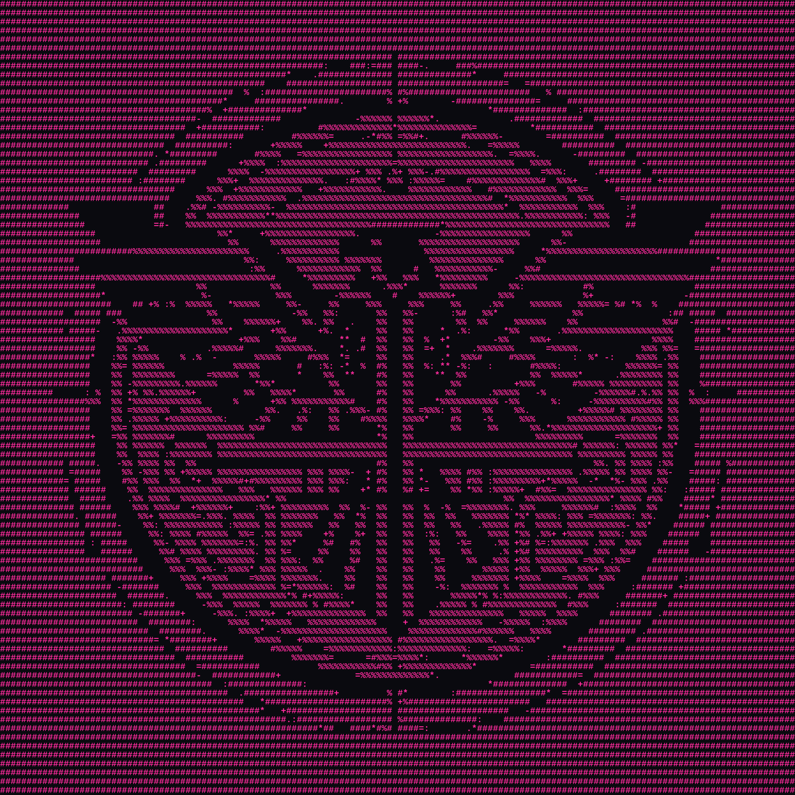

[](https://crates.io/crates/legatio)

[](https://opensource.org/licenses/MIT)

# legatio – Structured AI Workflow CLI

**legatio** is an advanced terminal-based tool for managing AI-driven projects and prompt engineering workflows. It’s designed for software engineers, researchers, and anyone who wants to streamline the interaction between code, knowledge sources (“scrolls”), and modern LLMs.




---

## ✨ Features

- Organize projects, prompts, and text files (“scrolls”) for AI workflows
- Powerful, keyboard-driven terminal user interface (ratatui and crossterm)
- Secure editing and chaining of prompts for reproducibility
- Ask AI models for output directly from the terminal
- Configurable backend (OpenAI, etc) and easy prompt chaining
- SQLite database for project, prompt, and scroll persistence

---

## 🚀 Installation

```sh
cargo install legatio
```

```sh
git clone https://github.com/EduardoNeville/legatio.git
cargo run --release
```

---

## 📝 Usage

Just run in your terminal:
```sh
legatio
```

You’ll be greeted by a UI with clear keyboard instructions at every step!

### Main Workflows

**[s]** = Select [Project|Scroll|Branch]
**[n]** = New [Project|Scroll|Branch]
**[d]** = Delete  [Project|Scroll|Branch]
**[e]** = Edit  [Project|Scroll|Branch]
**[a]** = Ask Model
**[q]** = Quit  

---

### Demo

#### Projects

[](https://asciinema.org/a/722660)

- Start `legatio`
- Select `[n]` to add a new project (chose relevant code or root directory of project)
- Use `[s]` to select an existing project
- Use `[d]` to delect an existing project

#### Scrolls

[](https://asciinema.org/a/722672)

- Press `[e]` or `[s]` as guided to enter the scrolls menu
- Add (`[n]`) or delete (`[d]`) context files as needed
- Scrolls can be code, markdown, text files, etc.

#### Branching

- In your project, select prompts to chain or create new ones
- Prompts serve as AI instructions
- Chaining allows you to build iterative workflows

#### Query your model

- With prompts and context/scrolls selected, 
- Write your prompt into the legatio.md file in the directory you created
- Press `[a]` to “Ask Model”
- Confirm `[y]`
- The AI’s response is saved in history and can seed new prompts


## ⚙️ Configuration

On first run, `legatio` creates a config directory `~/.config/legatio`.  
In the `config.toml` you can configure:
- Default LLM backend/model (e.g., openai/anthropic and the model name: gpt-4.1)
- Preferred color theme (Tokyo Storm, etc)
- API keys/secrets (handled securely)

## 💡 Tips

- Keyboard navigation: UI hints always in the top bar
- Errors are clearly displayed in the terminal
- Want to start fresh with a different project? `[p]` to switch

---

## 🛡️ Security

Your API keys are only stored locally and never sent elsewhere.  
Project data lives on your disk in your chosen work folder.

---

## 🛠️ Future Plans

- Scroll through the prompts and scrolls
- Select multiple scrolls (adding & deleting)
- Processing other file formats like (PDFs)
- Hidden files

---

## 📣 Feedback

Open an issue, PR, or discussion on [GitHub](https://github.com/EduardoNeville/legatio)!

## Licence
---

© 2025 Eduardo Neville.

All code is licensed under MIT. See  [LICENSE](./LICENSE.txt) file for details.


